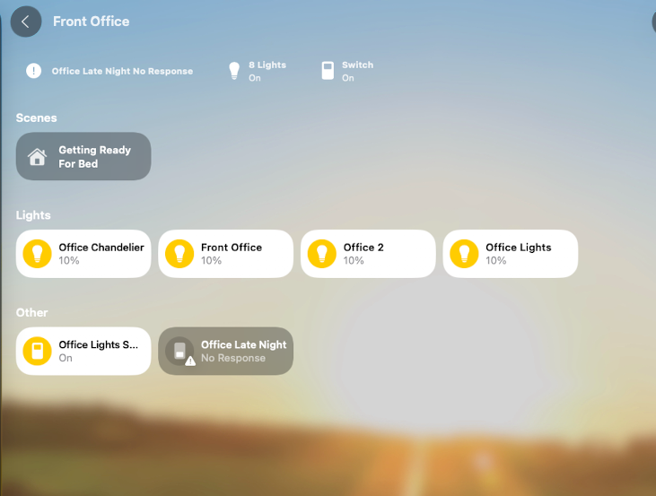

# HomeKit Room Sync

_note_ - never got this fully working, but feel free to cut a PR or fork if you have any ideas or suggestions 

[](https://github.com/lcrostarosa/homekit-room-sync)
[](https://github.com/hacs/integration)
[](https://opensource.org/licenses/MIT)
[](https://github.com/lcrostarosa/homekit-room-sync/blob/master/CONTRIBUTING.md)

A Home Assistant custom integration that automatically filters which entities are exposed to your HomeKit Bridge based on Home Assistant Areas — plus an optional companion script for actually placing them into matching Apple Home Rooms and Zones.

## Why This Exists

The [HomeKit Bridge configuration](https://www.home-assistant.io/integrations/homekit#configuration) in Home Assistant has **no concept of filtering entities by Area**.

You can filter by domains (lights, switches, fans, etc.) and use wildcards, but this approach is opinionated and becomes a maintenance headache over time. Every time you add a new device, you have to think about whether it matches your existing filters.

**The problem:** You organize your smart home by rooms (Areas) in Home Assistant, but HomeKit Bridge forces you to think in terms of entity types and naming patterns. This disconnect makes configuration fragile and tedious to maintain.

**The solution:** HomeKit Room Sync bridges this gap for *exposure*: organize your devices into Areas in Home Assistant, and this integration automatically keeps your HomeKit Bridge's entity filter in sync with them. Add a device to an Area once, and it starts showing up in your HomeKit Bridge without editing YAML.

**Important — read this before expecting HomeKit Rooms to update:** HomeKit **Room** and **Zone** assignment are not something any HomeKit bridge or accessory can set — including this one, and including Home Assistant's own `homekit` integration. We verified this directly against HA core's source: its `homekit` component has no `"room"` key anywhere in its schema. Room and Zone placement are controller-app-only concepts (the same mechanism Home.app itself uses, `HMHome.assignAccessory`/`addRoom`/`addZone`). This integration only controls *which* entities reach your HomeKit Bridge. If you also want them to land in the right Apple Home Room/Zone automatically, see [Apple Home Rooms and Zones](#apple-home-rooms-and-zones-macos-only-optional) below — that part requires a separate, optional macOS-only script.

## Installation

### HACS (Recommended)

1. Open HACS in your Home Assistant instance
2. Click on "Integrations"
3. Click the three dots in the top right corner
4. Select "Custom repositories"
5. Add this repository URL: `https://github.com/lcrostarosa/homekit-room-sync`
6. Select category: "Integration"
7. Click "Add"
8. Search for "HomeKit Room Sync" and install it
9. Restart Home Assistant

### Manual Installation

1. Download the `custom_components/homekit_room_sync` folder from this repository
2. Copy it to your Home Assistant `config/custom_components/` directory
3. Restart Home Assistant

## Configuration

1. Go to **Settings** → **Devices & Services**
2. Click **+ Add Integration**
3. Search for "HomeKit Room Sync"
4. Select one or more HomeKit Bridges from the list (friendly names are displayed)
5. Choose the Home Assistant Areas to include and optionally add manual include/exclude entity overrides
6. Click **Submit**


*Select the HomeKit Bridge you want to sync*

### Usage

Once configured, the integration works automatically in the background.

1. **Assign Areas in Home Assistant**: Go to **Settings > Devices & Services > Entities** and assign an **Area** to your entities (e.g., assign a Light to "Living Room").
2. **Wait for Sync**: The integration monitors these changes. After a short delay (debounced), it updates the HomeKit Bridge's entity filter (and any [auto-linked sensors](#auto-linked-sensors)) and reloads it.
3. **Check Apple Home**: Open the Home app on your iOS device. The device should now be *exposed* through your HomeKit Bridge. It will land in "Default Room" until you either move it by hand in Home.app, or run the optional [Rooms and Zones script](#apple-home-rooms-and-zones-macos-only-optional) below.


*An entity exposed through the HomeKit Bridge; placing it into the matching Room/Zone is handled by the separate script below, not by this integration.*

### Configuration Options

| Option | Description |
|--------|-------------|
| **HomeKit Bridges** | One or more HomeKit Bridge entries to manage (friendly names shown) |
| **Areas** | Limit syncing to entities assigned to the selected Home Assistant Areas |
| **Include entity overrides** | Always expose these entities, even if they are not in the allowed Areas |
| **Exclude entity overrides** | Never expose these entities, even if they would otherwise match |
| **Auto-link related sensors** | Automatically wire up battery/motion/humidity/etc. sensors for richer HomeKit accessory cards (see below). Enabled by default; can be disabled per bridge. |

### Auto-Linked Sensors

Home Assistant's HomeKit Bridge integration supports several `entity_config` options that make accessories show richer info in Apple Home (battery percentage, motion-triggered doorbell alerts, humidity/PM2.5 readings, filter maintenance) — but nothing wires them up automatically; normally you'd hand-edit `configuration.yaml` per entity.

When **Auto-link related sensors** is enabled, HomeKit Room Sync looks for sibling entities on the same Home Assistant *device* as each exposed entity and links them in automatically:

| Exposed entity | Auto-linked sibling (same device) | HomeKit effect |
|---|---|---|
| any entity | `sensor` with `device_class: battery` | Battery percentage shown on the accessory tile |
| any entity | `binary_sensor` with `device_class: battery_charging` | Charging indicator |
| `humidifier` | `sensor` with `device_class: humidity` | Current humidity reading |
| `fan` (air purifier) | `sensor` with `device_class: temperature` / `pm25` | Temperature / air quality readings |
| `camera`, `lock` | `binary_sensor` with `device_class: motion` | Motion-triggered notifications |
| `camera`, `lock` | `event` with `device_class: doorbell` | Doorbell press notifications |
| `switch` with `device_class: outlet` | *(itself)* | Exposed as a HomeKit **Outlet** instead of a generic switch |

This is **additive only** — it never overwrites a value you (or the native HomeKit integration options UI) already set for that entity, and it never removes a link once made, even if the sibling entity later disappears. To reset a stale link, clear it manually via the HomeKit Bridge integration's own entity options.

**Known gaps we can't close from here:** this add-on only edits the HomeKit Bridge's `filter`/`entity_config`, so it can't add capabilities that require new HAP accessory categories. Two examples from Apple's recent HomeKit work that fall outside that scope: HomeKit's Robot Vacuum Cleaner category (added in iOS 18.4) — Home Assistant's `homekit` integration still exposes `vacuum` entities as plain switches, not real vacuum accessories — and HomeKit Secure Video, which isn't implemented by the HomeKit Bridge integration at all. Fixing either would mean patching Home Assistant core's `homekit` component itself. Room and Zone assignment have a related but distinct issue and are covered separately below.

### Apple Home Rooms and Zones (macOS only, optional)

Apple Home **Rooms** and **Zones** (e.g. grouping "Bedroom" + "Bathroom" into an "Upstairs" zone) cannot be set by any HomeKit bridge or accessory — HAP simply has no characteristic for it. We confirmed this the hard way: earlier versions of this integration wrote an `entity_config[entity_id]["room"]` key believing it would move accessories into matching Rooms, but Home Assistant's own `homekit` component has **no `"room"` key anywhere in its schema** (checked its `const.py`, `accessories.py`, `util.py`, and `__init__.py` directly — zero references). That write was a silent no-op the entire time, which is why accessories exposed by this integration keep landing in "Default Room" no matter what. Both Room and Zone placement are controller-app-only concepts in real HomeKit (`HMHome.assignAccessory`/`addRoom`/`addZone` in Apple's HomeKit framework) — only an app with your HomeKit permission can do it, the same way Home.app itself does.

If you want Rooms and Zones set up automatically from HA's Area/Floor structure, [scripts/setup_homekit_rooms_and_zones.py](scripts/setup_homekit_rooms_and_zones.py) is an optional, separate helper that runs **on your Mac** (not on the HA server). It doesn't touch HomeKit itself — it reads your Areas/Floors from HA and writes a plain `homekit_rooms_and_zones_setup.command` shell script (double-click in Finder to run, like any other `.command` file) that drives HomeClaw, a native macOS app with the real HomeKit framework entitlement, to create a Room per Area (assigning entities into it) and a Zone per Floor (adding its Rooms into it):

```bash
pip install websockets
python3 scripts/setup_homekit_rooms_and_zones.py --ha-url http://homeassistant.local:8123 --ha-token <token>
# -> writes ./homekit_rooms_and_zones_setup.command
```

Then **open the generated file in a text editor and read it** — it's a short, plain shell script, and every command it will run is right there in plain sight, nothing is hidden behind Python subprocess calls. Preview it first (`./homekit_rooms_and_zones_setup.command --dry-run`), then run it for real once you're happy with it.

**There are two separate, legitimate CLI front-ends to HomeClaw, and it's easy to mix them up (we did, building this):**

| | `homeclaw-cli` | `homekit` |
|---|---|---|
| Where it comes from | Bundled inside [HomeClaw.app](https://apps.apple.com/us/app/homeclaw/id6759682551) itself (native Swift), `/Applications/HomeClaw.app/Contents/MacOS/` | Separate npm package [`homekit-cli`](https://github.com/l3wi/homekit-cli) (TypeScript), `npm i -g homekit-cli` |
| Command shape | Flat: `create-room`, `create-zone`, `add-room-to-zone <room> <zone>`, `assign-rooms <file.json>` | Grouped, gated behind `--allow-mutation`: `rooms create`, `rooms assign <accessory> <room>`, `zones create`, `zones add-room <zone> <room>` (note the reversed argument order from the flat CLI) |

Both talk to the same running HomeClaw app and both actually work — this script detects whichever is on your `PATH` and which command shape it advertises (via `--help`) at generation time, and only emits commands that one actually supports, rather than hard-coding guessed flags, since HomeClaw's own docs and release notes don't always agree with its actual CLI.

**Entities are matched to HomeKit accessories primarily by HAP Serial Number, not display name.** Home Assistant's own `homekit` bridge integration sets each exposed accessory's Serial Number characteristic (HAP type `00000030-0000-1000-8000-0026BB765291`) to the literal HA `entity_id` — confirmed against live data. The generator queries HomeClaw for every accessory's Serial Number and resolves to its HomeKit UUID wherever it matches (exact, unambiguous, and works even for generically-named/"unnamed device" entities that display-name matching can't handle), falling back to matching by display name only where no serial-number match exists.

Worth knowing before you run it — all confirmed by actually running the commands below against live HomeClaw installs, not just its docs:

- Requires HomeClaw installed from the Mac App Store (either CLI above needs the app running with HomeKit permission granted) on the machine you generate the `.command` file on.
- **(flat `homeclaw-cli` only) `assign-rooms` needs Full Disk Access.** It reads a JSON file, and its CLI runs inside its own App Sandbox — in testing, it couldn't read a file from `/tmp`, `~/Desktop`, `~/Documents`, or the current directory, all with the same "you don't have permission to view it" error. If you see that, grant your terminal app Full Disk Access in System Settings → Privacy & Security → Full Disk Access and re-run it. `create-room`/`create-zone`/`add-room-to-zone` don't need this (verified working without it). The grouped `homekit` CLI's `rooms assign` takes plain arguments instead of a file, so this doesn't come up there.
- Resolving every accessory's Serial Number means one extra CLI call per accessory at generation time — for a home with 100+ accessories this can take a bit (we tested against a real 132-accessory home; it resolved 129/132 by serial number, in well under a minute). It's best-effort: if listing/resolving fails outright, generation falls back to name-only matching for everything rather than aborting.
- Serial-number matching only covers accessories actually bridged through HA's `homekit` integration. Anything else falls back to name matching, which can still miss if the accessory's HomeKit name doesn't match its HA `friendly_name` — always check the `--dry-run` output for anything reported as not found. [haconnect](https://github.com/canadianblaken/ha-homekit-bridge-connect) goes further by physically actuating each device and watching for the matching state change instead of trusting any identifier to already agree, but it's very new (no real version history yet), so it isn't the default here.
- Whatever the generated script can't do, it prints exactly what to click in Home.app instead of guessing — it deliberately does **not** attempt to simulate clicks inside Home.app itself, since that would need Accessibility permission and unverified UI selectors that could misconfigure a real accessory if wrong.
- The most robust way to do this is actually interactive, not scripted: install HomeClaw, add its MCP server to your Claude Code / Claude Desktop config, and just ask Claude to set up your rooms/zones directly — a live agent can adapt to HomeClaw's real tool surface; this generated script can't.

### Multiple Bridges

You can manage **multiple HomeKit bridges inside a single HomeKit Room Sync entry**. Each bridge gets its own Area filters and include/exclude overrides. If you prefer to keep things isolated you can still add additional HomeKit Room Sync entries.

## How It Works

```
┌─────────────────────────────────────────────────────────────────┐
│                    Home Assistant                               │
│                                                                 │
│  ┌──────────────┐    ┌─────────────────────────┐                │
│  │ Entity/Area  │───▶│ HomeKit Room Sync       │                │
│  │ Registry     │    │ (Listens for changes)   │                │
│  └──────────────┘    └───────────┬─────────────┘                │
│                                  │                              │
│                                  ▼                              │
│                      ┌─────────────────────────┐                │
│                      │ HomeKit Config Entries  │                │
│                      │ (filter & entity_config)│                │
│                      └───────────┬─────────────┘                │
│                                  │                              │
│                                  ▼                              │
│                      ┌─────────────────────────┐                │
│                      │ homekit.reload service  │                │
│                      │ (Applies changes)       │                │
│                      └───────────┬─────────────┘                │
│                                  │                              │
└──────────────────────────────────┼──────────────────────────────┘
                                   │
                                   ▼
                        ┌─────────────────────┐
                        │   Apple HomeKit     │
                        │ (Updated exposure)  │
                        └─────────────────────┘
```

### Area Resolution Priority

For each entity, the Area used to decide inclusion (and, if you also run the [Rooms and Zones script](#apple-home-rooms-and-zones-macos-only-optional), which Room it's placed into) is determined in the following order:

1. **Entity's direct area**: If the entity has an area assigned directly
2. **Device's area**: If the entity's parent device has an area assigned
3. **No change**: If neither area is available, the entity isn't included by area (it can still be added via an include override)

## Important Notes

- Uses the official Home Assistant config-entry API (no direct `.storage` editing)
- Requires Home Assistant 2025.12.1 or newer so the HomeKit integration understands per-entry filters
- Each sync triggers a HomeKit reload for the affected bridge

### Supported Home Assistant Versions

- Home Assistant 2025.12.1 or newer

### Known Limitations

- Changes may take a few seconds to appear in the Apple Home app after sync
- This integration only controls entity *exposure* (the HomeKit Bridge's `filter`). It cannot place entities into Apple Home Rooms or Zones — no HomeKit bridge or accessory can; see [Apple Home Rooms and Zones](#apple-home-rooms-and-zones-macos-only-optional) for the separate, optional way to do that.

## Troubleshooting

### Sync Not Working

1. Check that the HomeKit Bridge integration is set up and running
2. Verify that entities are exposed to HomeKit
3. Check the Home Assistant logs for error messages

### Entities Stuck in "Default Room" / Showing "Continue Setup"

This is expected, not a bug in this integration — see [Apple Home Rooms and Zones](#apple-home-rooms-and-zones-macos-only-optional) above. "Continue Setup" is Apple Home's normal one-time prompt for any bridged accessory that's newly exposed but hasn't been individually added to the Home yet; tap through it once per new accessory.

### Enable Debug Logging

Add this to your `configuration.yaml`:

```yaml
logger:
  default: info
  logs:
    custom_components.homekit_room_sync: debug
```

## Development

### Setup

```bash
# Clone the repository
git clone https://github.com/lcrostarosa/homekit-room-sync.git
cd homekit-room-sync

# Install dependencies with Poetry
poetry install

# Run linting
poetry run ruff check .

# Run type checking
poetry run mypy custom_components/homekit_room_sync
```

### Local Deployment via SSH

For quick development iteration, you can deploy directly to your Home Assistant server using the included deploy script.

#### Quick Start

```bash
# Deploy to a specific host
make deploy HOST=192.168.1.100

# Or use the script directly
./scripts/deploy.sh homeassistant.local
```

#### Using Environment Variables

Create a `.env` file for persistent configuration:

```bash
# Copy the example file
cp env.example .env

# Edit with your settings
nano .env
```

Example `.env` configuration:

```bash
HA_HOST=192.168.1.100
HA_USER=root
HA_SSH_PORT=22
HA_CONFIG_PATH=/config
HA_RESTART=false
```

Then simply run:

```bash
make deploy
```

#### Deploy Script Options

```bash
./scripts/deploy.sh [OPTIONS] [HOST]

Options:
  -h, --help          Show help message
  -u, --user USER     SSH user (default: root)
  -p, --port PORT     SSH port (default: 22)
  -c, --config PATH   HA config directory (default: /config)
  -r, --restart       Restart Home Assistant after deployment
  --dry-run           Show what would be done without executing
```

#### Common Configuration Paths

| Installation Type | Config Path |
|-------------------|-------------|
| HAOS / Docker | `/config` |
| Supervised | `/usr/share/hassio/homeassistant` |
| Core (venv) | `/home/homeassistant/.homeassistant` |

### Contributing

Contributions are welcome! Please feel free to submit a Pull Request.

## License

This project is licensed under the MIT License - see the [LICENSE](LICENSE) file for details.

## Acknowledgments

- [Home Assistant](https://www.home-assistant.io/) for the amazing home automation platform
- [HACS](https://hacs.xyz/) for making custom integration distribution easy
